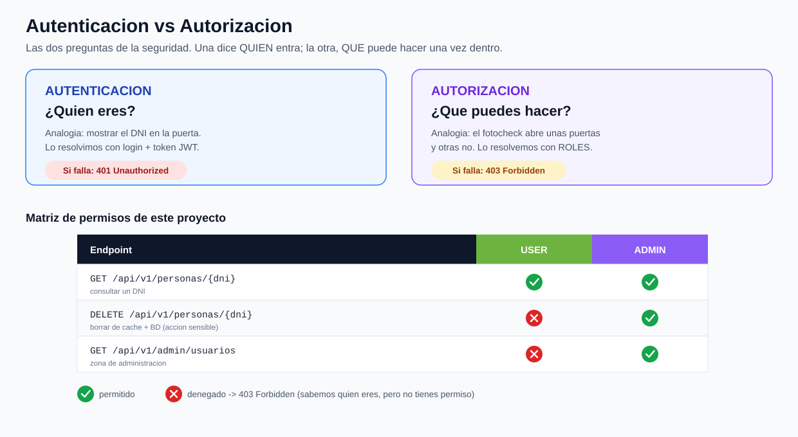

# reniec-security-jwt-roles · Proyecto 3 de 3

**Seguridad con Spring Boot — Parte 3: JWT + Roles (autorización) + usuarios en PostgreSQL**

Tercer y último proyecto de la serie. Aquí cerramos el círculo: ya sabíamos **¿quién eres?** (autenticación); ahora añadimos **¿qué puedes hacer?** (autorización), y movemos los usuarios de memoria a la base de datos.

1. `reniec-security` → Spring Security solo.
2. `reniec-security-jwt` → JWT.
3. **`reniec-security-jwt-roles`** (este) → **roles** (autorización) + usuarios en **PostgreSQL**.

---

## La gran idea: autenticación vs autorización

Son dos preguntas distintas, y los alumnos las confunden siempre:

- **Autenticación** = *¿quién eres?* → mostrar el DNI en la puerta. Si falla → **401 Unauthorized**.
- **Autorización** = *¿qué puedes hacer?* → tu fotocheck abre unas puertas y otras no. Si falla → **403 Forbidden**.

La diferencia entre 401 y 403 es el corazón de este proyecto: **401** es "no sé quién eres"; **403** es "sé quién eres, pero no tienes permiso".



---

## Tres cosas nuevas respecto al Proyecto 2

### 1. Los roles viajan DENTRO del token
Al hacer login, el `JwtService` mete los roles del usuario como un *claim* del token (ej: `["ROLE_USER","ROLE_ADMIN"]`). Así, en cada petición leemos los permisos **del propio token**, sin tocar la base de datos. Eso es ser *stateless* de verdad.

> Tradeoff (buen tema de discusión): si a alguien le quitas el rol ADMIN, su token **viejo** seguirá diciendo ADMIN hasta que venza. Por eso los tokens duran poco (15 min). En el mundo real se maneja con *refresh tokens*.

### 2. Autorización por rol, en sus dos formas
- **Por ruta** (en `SecurityConfig`): `requestMatchers("/api/v1/admin/**").hasRole("ADMIN")`.
- **Por método** (en el controlador): `@PreAuthorize("hasRole('ADMIN')")` sobre el endpoint de borrado.

### 3. Usuarios en PostgreSQL
Adiós a los usuarios "en memoria". Ahora hay una entidad `Usuario`, un `UsuarioRepository`, un `CustomUserDetailsService` que los lee de la BD, y un sembrador (`CargaInicialUsuarios`) que los crea al arrancar.

---

## Mapa de clases: qué hay de nuevo y qué cambió

| Clase | Qué hace | Estado |
|---|---|---|
| **`Usuario`** | Entidad JPA: los usuarios ahora viven en la tabla `usuarios`. | NUEVA |
| **`UsuarioRepository`** | Acceso a usuarios; incluye `findByUsername`. | NUEVA |
| **`CustomUserDetailsService`** | Puente BD ↔ Spring Security: carga el usuario desde PostgreSQL y arma sus autoridades (`ROLE_...`). | NUEVA |
| **`CargaInicialUsuarios`** | `CommandLineRunner` que siembra `alumno` y `admin` al arrancar (con clave cifrada). | NUEVA |
| **`AdminController`** | Endpoint solo-ADMIN (`/admin/usuarios`), protegido **por ruta**. | NUEVA |
| **`JwtService`** | Ahora mete y lee los **roles** del token. | cambió |
| **`JwtAuthenticationFilter`** | Lee los roles **del token** (ya no consulta la BD por petición). | cambió |
| **`SecurityConfig`** | `@EnableMethodSecurity`, regla por ruta para `/admin/**`, y sin usuarios en memoria. | cambió |
| **`ConsultaController`** | Nuevo `DELETE` solo-ADMIN protegido con **`@PreAuthorize`**. | cambió |
| `ConsultaServiceImpl` | Nuevo método `invalidar(dni)` (borra de cache + BD). | cambió |
| `AuthController`, `LoginRequest`, lógica de RENIEC | Sin cambios. | igual |

---

## Usuarios de prueba (se crean solos al arrancar)

| Usuario | Contraseña | Roles |
|---|---|---|
| `alumno` | `codigo123` | `USER` |
| `admin` | `admin123` | `USER, ADMIN` |

> `admin` tiene ambos roles para poder hacer todo lo de un USER y, además, lo exclusivo de ADMIN.

---

## Cómo levantarlo

```bash
docker compose up -d            # Redis + PostgreSQL
# pon tu token de RENIEC en src/main/resources/application.properties
mvn clean package
mvn spring-boot:run             # al arrancar, crea los usuarios en la BD
```

## Cómo probarlo (el momento "ajá": 401 vs 403)

```bash
# --- Como USER ---
# login y guarda el token
curl -s -X POST http://localhost:8080/api/v1/auth/login \
  -H "Content-Type: application/json" \
  -d '{"usuario":"alumno","clave":"codigo123"}'

# (usa el token USER en <TOKEN_USER>)
# consultar -> 200 (permitido a USER)
curl -i http://localhost:8080/api/v1/personas/46027897 -H "Authorization: Bearer <TOKEN_USER>"
# borrar -> 403 Forbidden (USER NO tiene permiso)
curl -i -X DELETE http://localhost:8080/api/v1/personas/46027897 -H "Authorization: Bearer <TOKEN_USER>"
# zona admin -> 403 Forbidden
curl -i http://localhost:8080/api/v1/admin/usuarios -H "Authorization: Bearer <TOKEN_USER>"

# --- Como ADMIN ---
curl -s -X POST http://localhost:8080/api/v1/auth/login \
  -H "Content-Type: application/json" \
  -d '{"usuario":"admin","clave":"admin123"}'

# (usa el token ADMIN en <TOKEN_ADMIN>)
# borrar -> 204 No Content (permitido a ADMIN)
curl -i -X DELETE http://localhost:8080/api/v1/personas/46027897 -H "Authorization: Bearer <TOKEN_ADMIN>"
# zona admin -> 200 (lista de usuarios)
curl -i http://localhost:8080/api/v1/admin/usuarios -H "Authorization: Bearer <TOKEN_ADMIN>"
```

El contraste a mostrar en clase: con el token de **USER**, el `DELETE` da **403**; con el de **ADMIN**, da **204**. Mismo endpoint, distinta autorización.

---

## Glosario (lo nuevo de este proyecto)

- **Autorización**: decidir *qué puede hacer* un usuario ya autenticado.
- **Rol**: una etiqueta de permiso (`USER`, `ADMIN`). En Spring, las autoridades se escriben con prefijo `ROLE_` (`ROLE_ADMIN`), y `hasRole('ADMIN')` lo agrega solo.
- **`@PreAuthorize`**: autorización **por método**; se evalúa antes de ejecutar el método.
- **`@EnableMethodSecurity`**: activa `@PreAuthorize` en la app.
- **403 Forbidden**: autenticado, pero sin permiso (≠ 401, que es no autenticado).
- **`CommandLineRunner`**: ejecuta código una vez al arrancar la app (lo usamos para sembrar usuarios).
- **Claim**: un dato dentro del payload del JWT (aquí, los roles).

---

## ⚠️ Aviso de versión

Spring Boot 3.5 → **Spring Security 6**. Para activar `@PreAuthorize` se usa **`@EnableMethodSecurity`** (en Security 5 era `@EnableGlobalMethodSecurity`, hoy obsoleto). Y `hasRole('ADMIN')` espera la autoridad `ROLE_ADMIN`: por eso `CustomUserDetailsService` agrega el prefijo `ROLE_` al construir las autoridades.

---

## 🎓 Cierre de la serie

Recorrimos los tres pasos: **Spring Security** (¿quién eres?) → **JWT** (login con token, stateless) → **Roles** (¿qué puedes hacer?). Y en cada paso, fíjense en lo que **nunca** tocamos: la lógica de RENIEC con su caché de 3 niveles quedó intacta los tres proyectos. La seguridad siempre fue una **capa que envuelve**, no algo metido dentro de la lógica de negocio. Esa es la misma lección de bajo acoplamiento que vimos con los clientes HTTP.

**Tarea sugerida**: agreguen un tercer rol (`SUPERVISOR`) que pueda consultar y borrar, pero no entrar a `/admin`. Si entendieron el proyecto, solo deberían tocar el sembrador de usuarios y una regla de autorización.
