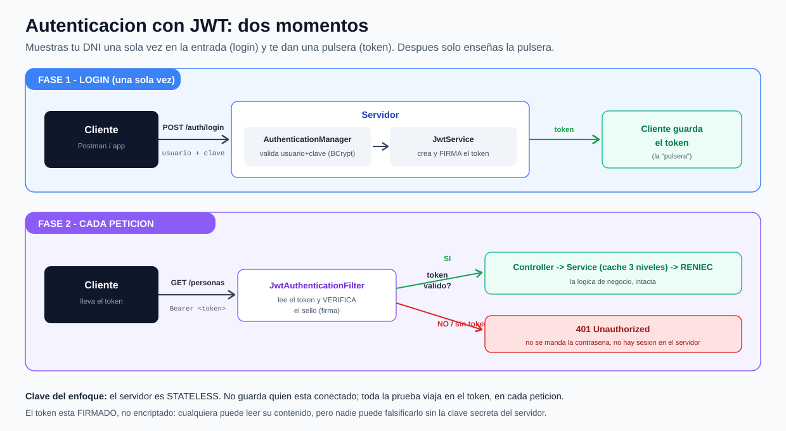

# reniec-security-jwt · Proyecto 2 de 3

**Seguridad con Spring Boot — Parte 2: Spring Security + JWT (login con token)**

Segundo proyecto de la serie. Parte del Proyecto 1 (Spring Security con usuarios en memoria) y cambia la **forma de autenticarse**: en vez de mandar usuario y clave en cada petición (HTTP Basic), hacemos **login una sola vez** y recibimos un **token JWT** que llevamos en cada llamada.

1. `reniec-security` → Spring Security solo. *¿quién eres?*
2. **`reniec-security-jwt`** (este) → le agregamos **JWT**.
3. `reniec-security-jwt-roles` → le agregamos **roles**. *¿qué puedes hacer?*

> La lógica de negocio (consumo de RENIEC + caché de 3 niveles) sigue **intacta**. Solo cambió cómo entras.

---

## La gran idea: la pulsera del concierto

Con HTTP Basic (Proyecto 1) mandábamos usuario y clave en **cada** petición. Incómodo e inseguro. Con **JWT** lo hacemos como en un concierto: muestras tu DNI **una sola vez** en la entrada (el **login**) y te dan una **pulsera** (el **token**). El resto de la noche solo enseñas la pulsera; nadie te vuelve a pedir el DNI.

Dos ideas que se deben llevar:

- El token está **firmado, no encriptado**. Cualquiera puede **leer** su contenido (péguenlo en `jwt.io`), pero **nadie puede falsificarlo** sin la clave secreta del servidor. → Nunca metas contraseñas ni datos sensibles en el token.
- El servidor es **stateless**: no guarda quién está conectado. Toda la prueba viaja en el token, en cada petición.



---

## Mapa de clases: qué hay de nuevo

| Clase | Qué hace | Nueva / cambió |
|---|---|---|
| **`JwtService`** ⭐ | La fábrica de tokens: los **crea** (en el login) y los **valida** (firma + expiración). Usa la librería jjwt. | **NUEVA** |
| **`JwtAuthenticationFilter`** ⭐ | Nuestro filtro (`OncePerRequestFilter`). En cada petición lee el header `Bearer`, valida el token y marca la identidad en el `SecurityContext`. | **NUEVA** |
| **`AuthController`** | Ahora tiene `POST /auth/login` (devuelve el token) además de `GET /auth/me`. | **cambió** |
| **`SecurityConfig`** | Ahora: stateless, login público, sin HTTP Basic, engancha el filtro JWT, expone el `AuthenticationManager`. | **cambió** |
| `LoginRequest` | DTO (record) con usuario y clave que llega en el login. | **NUEVA** |
| `GlobalExceptionHandler` | Agregó el manejo de credenciales inválidas en el login → 401. | **cambió** |
| `ConsultaController`, `ConsultaServiceImpl`, `ReniecRestClient`, etc. | La lógica de negocio. **No cambió.** | igual |

---

## Las piezas nuevas, explicadas

- **`JwtService`** — sabe **crear** el token (mete tu nombre, la fecha de emisión y de expiración, y lo **firma** con la clave secreta) y **validarlo** (verifica la firma y que no esté vencido). La clave secreta y el tiempo de vida están en `application.properties`.
- **`JwtAuthenticationFilter`** — el "portero que revisa la pulsera". Se ejecuta en **cada** petición, antes del controlador: si viene un token válido, le dice a Spring "esta persona está autenticada". Lo enganchamos en `SecurityConfig` con `.addFilterBefore(...)`.
- **`SecurityConfig`** — cuatro cambios respecto al Proyecto 1: sesión **STATELESS**, ruta `/auth/login` **pública**, **sin** `httpBasic`, y el **filtro JWT** enganchado. Además expone el `AuthenticationManager` que el login usa para validar usuario y clave.

---

## El flujo, en dos momentos

**Momento 1 — Login (una sola vez):**
1. `POST /api/v1/auth/login` con `{ "usuario": "...", "clave": "..." }`.
2. El `AuthenticationManager` valida usuario y clave (con BCrypt). Si fallan → **401**.
3. Si pasan, el `JwtService` genera el token y se devuelve al cliente.

**Momento 2 — Cada petición (con el token):**
1. `GET /api/v1/personas/{dni}` con header `Authorization: Bearer <token>`.
2. El `JwtAuthenticationFilter` lee y valida el token. Si es válido → marca la identidad y deja pasar al controlador. Si no (o falta) → **401**.

---

## Usuarios de prueba

| Usuario | Contraseña | Rol |
|---|---|---|
| `alumno` | `codigo123` | `USER` |
| `admin` | `admin123` | `ADMIN` |

> Los roles existen, pero **todavía no se usan para autorizar** (eso llega en el Proyecto 3).

---

## Cómo levantarlo

```bash
docker compose up -d            # Redis + PostgreSQL
# pon tu token de RENIEC en src/main/resources/application.properties
# (la clave JWT ya viene generada; en producción cámbiala por la tuya)
mvn clean package
mvn spring-boot:run
```

## Cómo probarlo (el flujo completo)

```bash
# 1) Sin token -> 401
curl -i http://localhost:8080/api/v1/personas/46027897

# 2) LOGIN -> devuelve el token
curl -i -X POST http://localhost:8080/api/v1/auth/login \
  -H "Content-Type: application/json" \
  -d '{"usuario":"alumno","clave":"codigo123"}'

# 3) Copia el token de la respuesta y úsalo (reemplaza <TOKEN>):
curl -i http://localhost:8080/api/v1/personas/46027897 \
  -H "Authorization: Bearer <TOKEN>"

# 4) ¿Quién soy? (con el token)
curl -i http://localhost:8080/api/v1/auth/me \
  -H "Authorization: Bearer <TOKEN>"

# 5) Login con clave mala -> 401
curl -i -X POST http://localhost:8080/api/v1/auth/login \
  -H "Content-Type: application/json" \
  -d '{"usuario":"alumno","clave":"claveMala"}'
```

En **Postman**: primero llamas a `/auth/login`, copias el `token`, y en las demás peticiones vas a **Authorization → Bearer Token** y lo pegas. Tip: pega el token en `jwt.io` y muéstrale a la clase que el payload se puede **leer** (pero no falsificar).

---

## Glosario (lo nuevo de este proyecto)

- **JWT (JSON Web Token)**: una credencial autocontenida con tres partes `header.payload.signature`.
- **Firmado, no encriptado**: el contenido es legible por cualquiera; lo que protege la firma es que **nadie lo pueda alterar**.
- **Bearer token**: el token se manda en el header `Authorization: Bearer <token>`.
- **Stateless**: el servidor no guarda sesiones; cada petición se valida sola por su token.
- **`OncePerRequestFilter`**: clase base de Spring para un filtro que corre **una vez por petición**.
- **`AuthenticationManager`**: el componente que valida usuario+clave; lo usamos en el login.
- **Expiración**: el token vence (aquí, 15 min). Si te lo roban, dura poco. (Renovarlo con *refresh tokens* es tema del mundo real.)

---

## ⚠️ Aviso de versión

Spring Boot 3.5 → **Spring Security 6** (bean `SecurityFilterChain`, sin `WebSecurityConfigurerAdapter`). La librería JWT es **jjwt 0.13.0**, con su API moderna: `Jwts.builder()...signWith(key).compact()` para crear y `Jwts.parser().verifyWith(key).build().parseSignedClaims(token)` para validar. Cuidado con tutoriales viejos que usan `Jwts.parserBuilder()` o `setSigningKey(String)`: esa API es de versiones 0.11 y anteriores.

---

## ➡️ Qué sigue (Proyecto 3)

Ya sabemos **quién eres** (autenticación). Falta **qué puedes hacer** (autorización). En el siguiente proyecto metemos los **roles** dentro del token y protegemos por rol: por ejemplo, que `/personas` lo vea cualquier usuario logueado, pero borrar solo el `ADMIN`. Además moveremos los usuarios de memoria a **PostgreSQL**.
