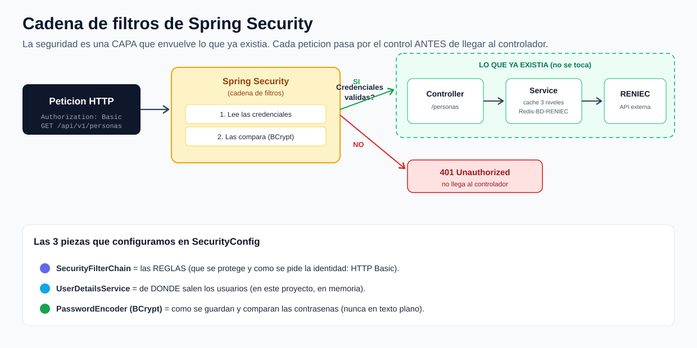

# reniec-security · Proyecto 1 de 3

**Seguridad con Spring Boot — Parte 1: Spring Security (autenticación)**

Este es el **primer proyecto** de una serie de tres con la que aprenderemos seguridad paso a paso:

1. **`reniec-security`** (este) → Spring Security **solo**. La pregunta que respondemos: **¿quién eres?** (autenticación).
2. `reniec-security-jwt` → le agregamos **JWT**: login que devuelve un token y deja de pedir la clave en cada petición.
3. `reniec-security-jwt-roles` → le agregamos **roles**. La pregunta: **¿qué puedes hacer?** (autorización).

> Partimos del proyecto que **consume RENIEC** con caché en 3 niveles. La lógica de negocio **no se tocó**: solo le pusimos una capa de seguridad encima. Esa es la idea central de este proyecto.

---

## La gran idea: la seguridad es una CAPA que envuelve

Lo más importante que se deben llevar: Spring Security **no se mete dentro** de tu lógica. Se mete **antes**, como el control de un aeropuerto. Cada petición pasa por una **cadena de filtros**; solo si supera el control, llega a tu controlador. Por eso el `ConsultaController`, el `Service` con el caché y el consumo de RENIEC siguen **exactamente igual** que antes: ni se enteran de que ahora hay que estar autenticado.



---

## Mapa de clases: qué hace cada una y cómo se relacionan

| Clase | Qué hace | Con quién se relaciona |
|---|---|---|
| **`SecurityConfig`** ⭐ | El **corazón**. Define las reglas (qué se protege, cómo se pide la identidad), de dónde salen los usuarios y cómo se cifran las claves. | Es leída por Spring al arrancar. Provee 3 beans que Security usa en cada petición. |
| `AuthController` | Endpoint **`/me`** que devuelve quién estás autenticado. Solo para *ver* que la seguridad funciona. | Recibe el `Authentication` que dejó Spring Security tras pasar el control. |
| `ConsultaController` | La API de negocio: `GET /api/v1/personas/{dni}`. **No cambió.** | Lo protege `SecurityConfig`. Llama al `ConsultaService`. |
| `ConsultaServiceImpl` | El cerebro: caché Redis → PostgreSQL → RENIEC. **No cambió.** | Usado por `ConsultaController`. Usa `ReniecRestClient` y `PersonaRepository`. |
| `ReniecRestClient` | Consume el API externo de RENIEC con RestTemplate. **No cambió.** | Usado por el service. |
| `GlobalExceptionHandler` | Traduce errores de **negocio** (404, 502, 400). **No maneja 401/403.** | Intercepta excepciones lanzadas en controladores y services. |
| resto (`Persona`, `PersonaResponse`, `repository`, `config/Redis`, `config/RestTemplate`) | Persistencia y consumo externo. **No cambió.** | La base que la seguridad envuelve. |

En negrita las dos clases **nuevas** de seguridad. Todo lo demás es el proyecto anterior intacto.

---

## Las 3 piezas de Spring Security (todas en `SecurityConfig`)

1. **`SecurityFilterChain`** — las **REGLAS**. Aquí decimos: desactiva CSRF (somos una API REST sin estado), exige autenticación para todo, y pide las credenciales con **HTTP Basic**.
2. **`UserDetailsService`** — de **DÓNDE** salen los usuarios. En este proyecto, definidos **en memoria** a propósito (para enfocarnos solo en seguridad). En el Proyecto 2/3 pasarán a PostgreSQL.
3. **`PasswordEncoder` (BCrypt)** — **CÓMO** se guardan las claves. Nunca en texto plano: se guarda un *hash* irreversible. BCrypt es lento a propósito (frena fuerza bruta) y agrega *salt* automático.

---

## El flujo de una petición, paso a paso

**Caso A — sin credenciales:**
1. Llega `GET /api/v1/personas/46027897` sin cabecera `Authorization`.
2. La cadena de filtros de Spring Security la intercepta.
3. No hay credenciales → responde **`401 Unauthorized`**. **Nunca llega al controlador.**

**Caso B — con credenciales válidas:**
1. Llega la misma petición con `Authorization: Basic <usuario:clave>`.
2. Security lee las credenciales y las compara contra el `UserDetailsService` usando BCrypt.
3. Coinciden → guarda la identidad en el `SecurityContext` y **deja pasar**.
4. Recién ahí entra al `ConsultaController` → `ConsultaService` (caché 3 niveles) → RENIEC.

---

## Usuarios de prueba (definidos en `SecurityConfig`)

| Usuario | Contraseña | Rol |
|---|---|---|
| `alumno` | `codigo123` | `USER` |
| `admin` | `admin123` | `ADMIN` |

> Los roles ya existen, pero en este proyecto **todavía no se usan** para autorizar. Eso llega en el Proyecto 3.

---

## Cómo levantarlo

```bash
docker compose up -d            # Redis + PostgreSQL
# pon tu token de RENIEC en src/main/resources/application.properties
mvn clean package
mvn spring-boot:run             # arranca en el puerto 8080
```

## Cómo probarlo (el momento "ajá": 401 → 200)

```bash
# 1) SIN credenciales -> 401 Unauthorized
curl -i http://localhost:8080/api/v1/personas/46027897

# 2) CON credenciales -> 200 OK (datos de la persona)
curl -i -u alumno:codigo123 http://localhost:8080/api/v1/personas/46027897

# 3) "¿Quién soy?" -> muestra el usuario y sus roles
curl -i -u alumno:codigo123 http://localhost:8080/api/v1/auth/me

# 4) Credenciales equivocadas -> 401 otra vez
curl -i -u alumno:claveMala http://localhost:8080/api/v1/personas/46027897
```

En Postman: la pestaña **Authorization → Basic Auth**, usuario `alumno`, clave `codigo123`.

---

## Glosario (términos nuevos)

- **Autenticación**: ¿*quién eres*? (mostrar el DNI en la puerta). Es lo que vemos en este proyecto.
- **Autorización**: ¿*qué puedes hacer*? (tu fotocheck abre unas puertas y otras no). Llega en el Proyecto 3.
- **Filter chain (cadena de filtros)**: la fila de "checkpoints" por la que pasa cada petición antes de llegar a tu código.
- **HTTP Basic**: mandar usuario y clave (en base64) en la cabecera `Authorization` en *cada* petición. Lo más simple para empezar; en el Proyecto 2 lo reemplaza el token JWT.
- **BCrypt**: algoritmo para guardar contraseñas como *hash* irreversible, lento a propósito y con *salt*.
- **401 Unauthorized**: no sabemos quién eres (falta o falla la autenticación).
- **403 Forbidden**: sabemos quién eres, pero **no tienes permiso** (falla la autorización). Lo veremos a fondo en el Proyecto 3.
- **`SecurityContext`**: donde Spring Security guarda la identidad del usuario una vez autenticado, para que el resto de la app la pueda consultar.

---

## ⚠️ Aviso de versión

Vamos con **Spring Boot 3.5 → Spring Security 6**. Aquí **ya no existe** `WebSecurityConfigurerAdapter`: todo se configura con el **bean `SecurityFilterChain`** y el estilo de *lambdas* que ven en `SecurityConfig`. Si encuentran tutoriales con `extends WebSecurityConfigurerAdapter`, están **desactualizados** (es la trampa #1 al googlear seguridad en Spring).

---

## ➡️ Qué sigue (Proyecto 2)

Noten una incomodidad de este proyecto: con HTTP Basic, mandamos usuario y clave en **cada** petición. En el siguiente proyecto resolvemos eso con **JWT**: hacemos login **una vez** en `POST /auth/login`, recibimos un **token**, y a partir de ahí solo llevamos ese token. Como la pulsera de un concierto: muestras el DNI una vez en la entrada y después solo enseñas la pulsera.
